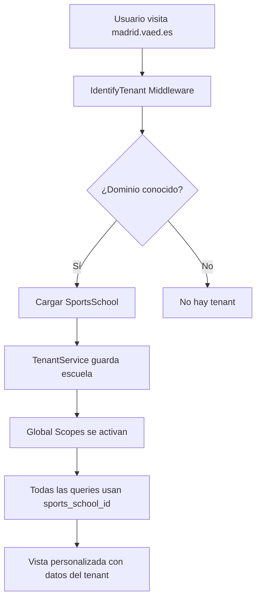

# 🏢 Sistema Multi-Tenant Domain-Based

## 📋 Descripción

Este sistema permite que múltiples escuelas deportivas (tenants) compartan la misma aplicación Laravel, pero cada una con:
- ✅ **Su propio dominio o subdominio**
- ✅ **Home y páginas personalizadas**
- ✅ **Logo y branding propio**
- ✅ **Datos completamente segregados**
- ✅ **Plantillas compartidas para operaciones comunes**

---

## 🎯 Casos de Uso

### 1️⃣ Escuela CON dominio propio
```
www.clubdeportivomadrid.com → Apunta a tu servidor
Logo: Logo del club
Home: Personalizada con datos del club
Datos: Solo de esa escuela
```

### 2️⃣ Escuela SIN dominio propio
```
madrid.vaed.es → Subdominio en tu servidor
Logo: Logo del club
Home: Personalizada con datos del club
Datos: Solo de esa escuela
```

### 3️⃣ Dominio principal (Master)
```
vaed.es → Panel administrativo global
Acceso: Solo usuarios con rol "master"
Funcionalidad: Gestión de todas las escuelas
```

---

## 🏗️ Arquitectura Implementada

### Componentes Principales

#### 1. **Middleware `IdentifyTenant`**
- **Ubicación:** `app/Http/Middleware/IdentifyTenant.php`
- **Función:** Detecta automáticamente el tenant por dominio/subdominio
- **Lógica de detección:**
  1. Busca por dominio completo exacto
  2. Busca sin "www"
  3. Busca por slug en subdominios `*.vaed.es`
  4. Si es dominio master, no asigna tenant

#### 2. **TenantService**
- **Ubicación:** `app/Services/TenantService.php`
- **Función:** Gestión centralizada del tenant actual
- **Métodos principales:**
  - `setCurrentSchool()` - Asignar escuela actual
  - `getCurrentSchool()` - Obtener escuela actual
  - `getCurrentSchoolId()` - Obtener ID de escuela actual
  - `hasCurrentSchool()` - Verificar si hay contexto de tenant

#### 3. **Trait `BelongsToTenant`**
- **Ubicación:** `app/Models/Traits/BelongsToTenant.php`
- **Función:** Añadir funcionalidad multi-tenant a modelos
- **Características:**
  - Auto-asigna `sports_school_id` al crear registros
  - Aplica scope global automáticamente
  - Añade relación con SportsSchool

#### 4. **Global Scope `TenantScope`**
- **Ubicación:** `app/Models/Scopes/TenantScope.php`
- **Función:** Filtra automáticamente todas las queries por `sports_school_id`
- **Métodos especiales:**
  - `withoutTenant()` - Ignorar filtro de tenant
  - `forSchool($id)` - Cambiar de tenant temporalmente
  - `allTenants()` - Obtener datos de todos los tenants

#### 5. **Helpers Globales**
- **Ubicación:** `app/helpers.php`
- **Funciones disponibles:**
  ```php
  tenantService()      // Obtener el servicio
  currentSchool()      // Obtener la escuela actual
  currentSchoolId()    // Obtener el ID de la escuela
  tenantConfig($key)   // Obtener configuración del tenant
  tenantLogo()         // URL del logo del tenant
  tenantName()         // Nombre del tenant
  isTenantContext()    // Verificar si hay tenant activo
  ```

---

## 🚀 Cómo Implementar en tus Modelos

### Opción 1: Usar el Trait (Recomendado)

```php
<?php

namespace App\Models;

use Illuminate\Database\Eloquent\Model;
use App\Models\Traits\BelongsToTenant;

class Player extends Model
{
    use BelongsToTenant; // ← Añade esto
    
    protected $fillable = [
        'name',
        'email',
        'sports_school_id', // Ya no necesitas asignarlo manualmente
        // otros campos...
    ];
}
```

**¿Qué hace automáticamente?**
- ✅ Filtra todas las queries por `sports_school_id`
- ✅ Asigna `sports_school_id` al crear registros
- ✅ Añade relación `sportsSchool()`
- ✅ Añade scopes `forSchool()` y `forCurrentSchool()`

### Opción 2: Sin el Trait (Manual)

Si prefieres control manual:

```php
// Al crear
Player::create([
    'name' => 'Juan',
    'sports_school_id' => currentSchoolId(),
]);

// Al consultar
Player::where('sports_school_id', currentSchoolId())->get();
```

---

## 📝 Ejemplo de Uso en Controladores

```php
<?php

namespace App\Http\Controllers;

use App\Models\Player;
use App\Models\Team;

class PlayerController extends Controller
{
    public function index()
    {
        // Automáticamente filtra por la escuela actual
        $players = Player::all();
        
        // También puedes ser explícito
        $players = Player::forCurrentSchool()->get();
        
        return view('players.index', compact('players'));
    }
    
    public function store(Request $request)
    {
        // sports_school_id se asigna automáticamente
        $player = Player::create($request->validated());
        
        return redirect()->route('players.index');
    }
    
    // Admin Master: Ver jugadores de todas las escuelas
    public function indexAllSchools()
    {
        // Usuario master viendo todos los tenants
        $players = Player::withoutTenant()->get();
        
        // O de una escuela específica
        $players = Player::forSchool(5)->get();
        
        return view('admin.players.index', compact('players'));
    }
}
```

---

## 🌐 Configuración de Dominios

### Base de Datos

En la tabla `sports_schools` añade el dominio:

```sql
UPDATE sports_schools 
SET domain = 'madrid.vaed.es', 
    slug = 'madrid'
WHERE id = 1;

UPDATE sports_schools 
SET domain = 'www.clubdeportivo.com', 
    slug = 'club-deportivo'
WHERE id = 2;
```

### DNS y Hosting

#### Para subdominios (*.vaed.es)
```
Registro DNS Tipo A:
*.vaed.es → IP_DE_TU_SERVIDOR
```

#### Para dominios propios
```
Cliente configura en su proveedor:
www.clubdeportivo.com → IP_DE_TU_SERVIDOR
clubdeportivo.com → IP_DE_TU_SERVIDOR
```

### Nginx/Apache

#### Nginx
```nginx
server {
    listen 80;
    server_name vaed.es *.vaed.es clubdeportivo.com www.clubdeportivo.com;
    
    root /path/to/SVAclubsportal/public;
    index index.php;
    
    location / {
        try_files $uri $uri/ /index.php?$query_string;
    }
    
    location ~ \.php$ {
        fastcgi_pass unix:/var/run/php/php8.2-fpm.sock;
        fastcgi_index index.php;
        include fastcgi_params;
    }
}
```

#### Apache (.htaccess ya configurado)
```apache
<VirtualHost *:80>
    ServerName vaed.es
    ServerAlias *.vaed.es
    ServerAlias clubdeportivo.com
    ServerAlias www.clubdeportivo.com
    
    DocumentRoot /path/to/SVAclubsportal/public
    
    <Directory /path/to/SVAclubsportal/public>
        AllowOverride All
        Require all granted
    </Directory>
</VirtualHost>
```

---

## 🎨 Personalización de Vistas

### En Blade

```blade
{{-- Logo personalizado --}}
@if(tenantLogo())
    
@endif

{{-- Nombre personalizado --}}
<h1>Bienvenido a {{ tenantName() }}</h1>

{{-- Email personalizado --}}
<a href="mailto:{{ tenantConfig('email') }}">Contacto</a>

{{-- Verificar contexto --}}
@if(isTenantContext())
    <p>Estás en el contexto de {{ currentSchool()->name }}</p>
@else
    <p>Panel administrativo master</p>
@endif

{{-- Datos de la escuela --}}
@if($school = currentSchool())
    <div>
        <p>{{ $school->address }}</p>
        <p>{{ $school->city }}, {{ $school->province }}</p>
        <p>{{ $school->phone }}</p>
    </div>
@endif
```

### Layout Compartido con Personalización

```blade
{{-- resources/views/webclubs/layouts/app.blade.php --}}
<!DOCTYPE html>
<html>
<head>
    <title>{{ tenantName() }} - @yield('title')</title>
    @vite(['resources/css/app.css', 'resources/js/app.js'])
</head>
<body>
    <nav>
        @if(tenantLogo())
            
        @endif
        <span>{{ tenantName() }}</span>
    </nav>
    
    <main>
        @yield('content')
    </main>
    
    <footer>
        <p>&copy; {{ date('Y') }} {{ tenantName() }}</p>
    </footer>
</body>
</html>
```

### Estructura de Vistas

```
resources/views/
├── webclubs/                    # Webs públicas de los clubes
│   ├── layouts/
│   │   └── app.blade.php       # Layout compartido
│   ├── home.blade.php          # Home del club
│   ├── about.blade.php         # Sobre nosotros
│   ├── contact.blade.php       # Contacto
│   └── registration.blade.php  # Inscripción de jugadores
├── livewire/                    # Componentes Livewire (panel admin)
└── dashboard.blade.php          # Dashboard admin
```

---

## 🔐 Control de Acceso

### En Middleware Existente

Actualizar `EnsureSchoolUser`:

```php
public function handle(Request $request, Closure $next): Response
{
    // Master siempre tiene acceso
    if (auth()->user()->hasRole('master')) {
        return $next($request);
    }
    
    // Verificar que el usuario pertenezca al tenant actual
    if (!tenantService()->userHasAccess(auth()->user())) {
        abort(403, 'No tienes acceso a esta escuela');
    }
    
    return $next($request);
}
```

### En Livewire Components

```php
<?php

namespace App\Livewire\Players;

use Livewire\Component;
use App\Models\Player;

class Index extends Component
{
    public function render()
    {
        // Automáticamente filtra por tenant
        $players = Player::paginate(10);
        
        return view('livewire.players.index', [
            'players' => $players,
        ]);
    }
    
    public function create()
    {
        // Se asigna sports_school_id automáticamente
        Player::create([
            'name' => $this->name,
            'email' => $this->email,
            // sports_school_id se añade por el trait
        ]);
    }
}
```

---

## 🧪 Testing

```php
<?php

namespace Tests\Feature;

use Tests\TestCase;
use App\Models\Player;
use App\Models\SportsSchool;

class TenantTest extends TestCase
{
    public function test_players_filtered_by_tenant()
    {
        $school1 = SportsSchool::factory()->create();
        $school2 = SportsSchool::factory()->create();
        
        Player::factory()->create(['sports_school_id' => $school1->id]);
        Player::factory()->create(['sports_school_id' => $school2->id]);
        
        // Simular contexto de tenant
        tenantService()->setCurrentSchool($school1);
        
        $players = Player::all();
        
        $this->assertCount(1, $players);
        $this->assertEquals($school1->id, $players->first()->sports_school_id);
    }
    
    public function test_home_shows_tenant_info()
    {
        $school = SportsSchool::factory()->create([
            'domain' => 'test.vaed.es',
            'name' => 'Test School',
        ]);
        
        $response = $this->get('/', ['HTTP_HOST' => 'test.vaed.es']);
        
        $response->assertSee('Test School');
        $response->assertStatus(200);
    }
}
```

---

## ⚠️ Consideraciones Importantes

### 1. **Modelos que DEBEN usar el Trait**
- ✅ Player
- ✅ Team
- ✅ Training
- ✅ Exercise
- ✅ Season
- ✅ Category
- ✅ PaymentTeam
- ✅ PaymentPlayer
- ✅ InscriptionTeam
- ✅ TrainingField
- ✅ TrainingSession

### 2. **Modelos que NO deben usar el Trait**
- ❌ User (ya tiene `sports_school_id` pero es especial)
- ❌ SportsSchool (es el tenant mismo)
- ❌ Brand (es global)
- ❌ Role/Permission (son globales)

### 3. **Usuario Master**
- Puede ver y gestionar todas las escuelas
- No se le aplica el filtro de tenant automáticamente
- Necesita usar `withoutTenant()` o `forSchool($id)` explícitamente

### 4. **Migraciones**
Asegúrate de que todas las tablas tengan:
```php
$table->foreignId('sports_school_id')->constrained()->onDelete('cascade');
$table->index('sports_school_id');
```

### 5. **Caché**
Incluye el tenant en las claves de caché:
```php
Cache::remember('stats_' . currentSchoolId(), 3600, function() {
    // tu lógica
});
```

---

## 🚦 Flujo Completo



---

## 📦 Checklist de Implementación

- [x] Middleware `IdentifyTenant` creado
- [x] `TenantService` implementado
- [x] Trait `BelongsToTenant` creado
- [x] Global Scope `TenantScope` implementado
- [x] Helpers globales añadidos
- [x] Service Provider registrado
- [x] Middleware configurado en `bootstrap/app.php`
- [x] Controlador `TenantHomeController` creado
- [x] Vistas en `webclubs/` creadas con layout compartido
- [x] Rutas configuradas con nombres `webclubs.*`

### Próximos Pasos

1. **Añadir el trait a tus modelos existentes:**
   ```php
   use App\Models\Traits\BelongsToTenant;
   ```

2. **Configurar dominios en la base de datos**

3. **Configurar DNS y servidor web**

4. **Personalizar las vistas según necesites**

5. **Testing exhaustivo**

---

## 💡 Ejemplos de Casos de Uso

### Registro Público de Jugadores
```php
Route::post('/registro-jugador', function(Request $request) {
    // Se crea automáticamente con el sports_school_id del tenant actual
    Player::create($request->validated());
});
```

### Pagos
```php
// El pago se asocia automáticamente al tenant
PaymentPlayer::create([
    'player_id' => $playerId,
    'amount' => 100,
    // sports_school_id añadido automáticamente
]);
```

### Convocatorias
```php
// Solo entrenamientos del tenant actual
$sessions = TrainingSession::where('date', '>=', now())->get();
```

---

## 🆘 Troubleshooting

### Problema: No detecta el tenant
- Verificar que el dominio está en la tabla `sports_schools`
- Verificar DNS/hosts
- Verificar que `is_active = 1`

### Problema: Ve datos de otras escuelas
- Verificar que el modelo usa el trait `BelongsToTenant`
- Verificar que la query no usa `withoutTenant()`
- Verificar que el usuario no es "master"

### Problema: No puede crear registros
- Verificar que hay un tenant activo: `currentSchool()`
- Verificar que `sports_school_id` está en `$fillable`

---

## 📚 Recursos Adicionales

- [Documentación Laravel Multi-tenancy](https://laravel.com)
- [Spatie Laravel Multitenancy](https://spatie.be/docs/laravel-multitenancy)
- [Laravel Global Scopes](https://laravel.com/docs/eloquent#global-scopes)

---

**¡Listo para usar! 🎉**
